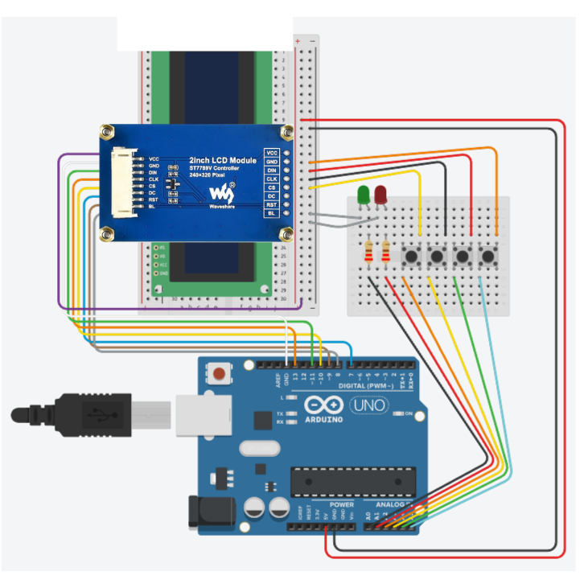
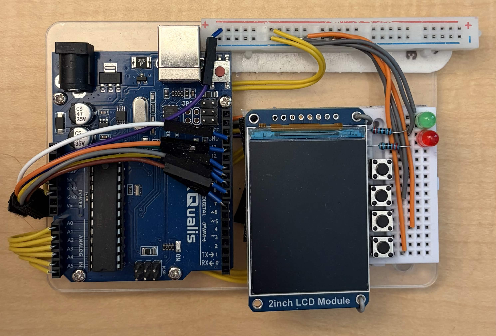

## About
Is there a specific need for a new MCDU or FMC program? Not really. But, I thought it would be very interesting to design and deploy my own iteration of one.
So, that being said, this is my prototype of my Arduino-based FMC. I took the design inspiration from both Airbus & Boeing's respective 
[MCDU](https://www.reddit.com/media?url=https%3A%2F%2Fi.redd.it%2Fwhat-did-i-do-wrong-with-my-mcdu-v0-qydxlcbrvacf1.png%3Fwidth%3D871%26format%3Dpng%26auto%3Dwebp%26s%3Dcd1b954b9ccdbb986bca799ad3e9197850488fb7) 
& 
[FMC](https://i.redd.it/nb0xehwo3c2a1.jpg) 
systems, using the button modules to the right of the display as makeshift side-screen buttons. Sort of leaving both design types behind, I took my software design inspiration
from what I would like to see on a modern FMC. Does it differ much from the current software? No. Not really. I think any new graphical design choices could potentially make
the program confusing if used in a real flight scenario.

## Circuit Diagram + Functional Model (Arduino Uno REV3)

